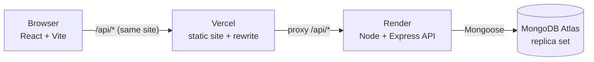
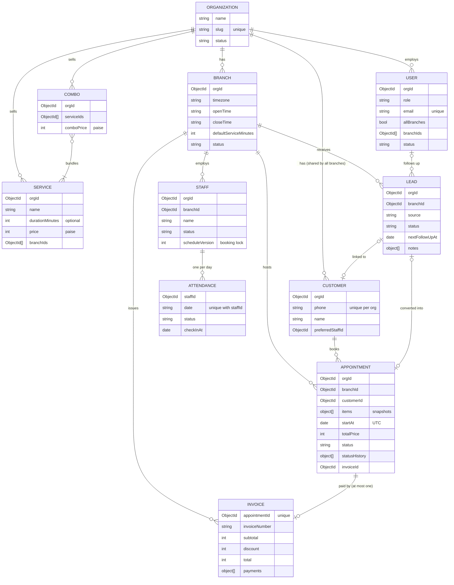

# GrowwPilot

**A multi-tenant salon management and CRM SaaS**, built with MongoDB, Express, React and Node (MERN).

GrowwPilot runs many salons on one platform. Each salon (an *organization*) has one or more branches, its own staff, services, customers, leads, bookings and payments, and it can never see another salon's data.

- **Live demo:** growwpilot.vercel.app
- **Demo accounts:** login page has a clickable "Demo accounts" list

| Role | Email | What to try |
|---|---|---|
| Super Admin | `admin@growwpilot.com` | Onboard a salon, deactivate one |
| Owner, all branches | `owner@glamour.com` | Dashboard, analytics + PDF, team, catalogue |
| Owner, one branch | `bandra.owner@glamour.com` | Same screens, limited to the Bandra branch |
| Front desk | `desk.andheri@glamour.com` | Day board, booking, checkout, leads, attendance |
| Front desk | `desk.bandra@glamour.com` | The Bandra branch |
| Owner, another salon | `owner@desertrose.com` | A second salon in Dubai (different timezone) |
| Front desk, another salon | `desk@desertrose.com` | |

---

## Contents

1. [What it does](#1-what-it-does)
2. [Architecture](#2-architecture)
3. [Data model (ER diagram)](#3-data-model-er-diagram)
4. [Run it locally](#4-run-it-locally)
5. [Tests](#5-tests)
6. [Deployment](#6-deployment)
7. [Assumptions](#7-assumptions)
8. [Product and UX decisions](#8-product-and-ux-decisions)
9. [Technical decisions](#9-technical-decisions)
10. [Trade-offs](#10-trade-offs)
11. [Known limitations](#11-known-limitations)
12. [Tenant isolation smoke test](#12-tenant-isolation-smoke-test)
13. [AI usage](#13-ai-usage)
14. [Future scope](#14-future-scope)

---

## 1. What it does

| Who | Logs in? | Main screens |
|---|---|---|
| **Super Admin** (GrowwPilot team) | Yes | Salon list with search and status filter; onboarding (salon + first branch + owner login in one step); activate or deactivate a salon |
| **Owner** | Yes | **Dashboard** (Salon Pulse, KPIs, Requires attention), **Analytics** (demand charts + sales PDF), branches, team (staff, front desk logins, branch owners), services and combos, plus everything the front desk sees |
| **Front desk** | Yes | **Day board**, booking (multi-service or combo), appointment list, customers, leads (and convert to appointment), checkout with split payments, staff attendance. Works in **one branch only**. |
| **Staff** (stylists) | No | A record: booked on appointments, attendance marked by the front desk |
| **Customer** | No | A record: created by the front desk or by converting a lead |

There are **two kinds of owner**: the **primary owner** sees and manages every branch, and a **branch owner** only sees the branches the primary owner gives them.

**Help assistant:** owners and front desk users also get a round chat button at the bottom right. Ask it *"how do I take a split payment?"* or *"what does Salon Pulse mean?"* and it answers with the steps **for your role**, links you to the right screen, and tells a front desk user who to ask for owner-only tasks. The **Need help?** link in the sidebar still emails GrowwPilot support.

---

## 2. Architecture



- **Frontend (`client/`):** React 19, React Router, TanStack Query (caching, auto-refresh every 60 s on live screens), react-hook-form + Zod, Tailwind CSS, Recharts, Luxon.
- **Backend (`server/`):** Express 5, Mongoose, Zod validation, JWT in an httpOnly cookie, bcrypt, Luxon, pdfkit.
- **Database:** MongoDB Atlas. A replica set is required because bookings, checkout, onboarding and lead conversion use **transactions**.
- **Same-site cookie:** Vercel forwards `/api/*` to Render, so the browser only ever talks to one site and the login cookie is first-party (no cross-site cookie problems).

**Backend layers:** `routes → controller → service → model`

```
server/src/
  config/        env.js (checks env vars at start-up), db.js, constants.js
  middleware/    auth (who are you), tenantContext (which salon/branches), requireRole, validate (Zod), errorHandler
  modules/       one folder per feature: *.routes.js, *.controller.js, *.service.js, *.schemas.js
                 admin, auth, branches, staff, users, services, combos, customers, appointments
                 (+ scheduling.service.js = the booking engine), leads, invoices, attendance, dashboard, analytics
  models/        one Mongoose model per collection
  utils/         time (branch time <-> UTC), money (paise), phone, scoped, stateMachine, appointmentAlerts
  scripts/       seed.js, isolation-smoke-test.js
server/tests/    Vitest tests (in-memory MongoDB replica set)
client/src/
  api/           axios client + React Query hooks per feature
  components/    ui/ kit (Button, Input, Modal, Drawer, Table...) + shared pieces
  features/      admin, auth, dashboard, appointments, customers, leads, checkout, attendance, team, catalog, branches, analytics
  layouts/       AdminLayout, AppLayout (role-based sidebar + branch switcher)
  routes/        router.jsx, ProtectedRoute.jsx
```

**Every request** to salon data goes through `requireAuth` (loads the user from the database on every request, so deactivation takes effect immediately) → `tenantContext` (builds `req.ctx = { orgId, allowedBranchIds, activeBranchId }` from the user, never from the request) → `requireRole` → `validate` → the controller.

---

## 3. Data model (ER diagram)



**Important indexes:** `customer (orgId, phone)` unique (no duplicate customers), `invoice.appointmentId` unique (no double checkout), `attendance (staffId, date)` unique, `appointment (orgId, branchId, startAt)` and `appointment (items.staffId, items.startAt)` for the day board and clash checks.

---

## 4. Run it locally

You need **Node 20+** and a free **MongoDB Atlas** cluster (Atlas is a replica set, which transactions need; a plain local `mongod` is not).

```bash
# 1. API  ->  http://localhost:5000 (or the PORT in .env)
cd server
cp .env.example .env    # add your Atlas URI (keep /growwpilot in it) and a JWT secret
npm install
npm run seed            # wipes the database and loads the demo data below
npm run dev

# 2. Web app  ->  http://localhost:5199
cd client
cp .env.example .env    # API_PROXY_TARGET = the API URL above
npm install
npm run dev
```

**Demo data** (`npm run seed`): 2 salons, 3 branches (Mumbai and Dubai timezones), 8 staff, 10 services, 2 combos, 13 customers, 9 leads (every status and source, some overdue), about 100 appointments over 4 weeks (every status, multi-service and combo bookings, split payments, discounts) with 85 invoices, and 2 weeks of attendance. **Today's appointments are placed around the current time**, so the day board and dashboard always show something happening: a customer waiting, a possible no-show, one running late, a bill not collected, and tomorrow's booking with a stylist on leave. (Seed during opening hours for the best picture: after closing time, today's later bookings are already in the past and show up as possible no-shows.) The seed refuses to run when `NODE_ENV=production` unless you pass `-- --force`.

---

## 5. Tests

```bash
cd server
npm test                  # 94 Vitest tests, on a temporary in-memory MongoDB replica set (never your real data)
npm run smoke:isolation   # tenant isolation check against a running API with the demo seed (see section 12)
```

The tests cover the parts where a bug would cost money or trust:

- **Booking engine:** the PDF's overlap example (2:00–2:45 vs 2:30), back-to-back bookings allowed, **two and five simultaneous bookings where exactly one wins**, opening hours, inactive/absent/other-branch stylists, another salon's ids, Kolkata vs Dubai time, availability, rescheduling onto its own slot.
- **State machines:** every allowed and blocked appointment and lead status change.
- **Lead conversion:** links to an existing customer by phone; a clash rolls back everything (no customer, no booking, lead unchanged).
- **Checkout:** ₹1,530 = 1,000 + 500 + 30 works; ₹30 short fails; discount larger than the bill fails; paying twice (including two desks at the same moment) fails; invoice numbers never skip.
- **Dashboard warnings:** no-show, waiting and running-late rules.
- **Help assistant:** 26 typical questions land on the right topic; answers are limited to the asker's role (front desk vs owner, main owner vs branch owner); unknown questions get an honest "not sure" with suggestions.

---

## 6. Deployment

The repo includes `render.yaml` (API) and `client/vercel.json` (web app).

1. **MongoDB Atlas:** create a database user. Under *Network Access* allow `0.0.0.0/0` (Render's free plan has no fixed IP). Copy the connection string and keep `/growwpilot` as the database name.
2. **Render (API):** *New → Blueprint →* this repo. Fill in `MONGODB_URI` and `CLIENT_ORIGIN` (your Vercel URL). `JWT_SECRET` is generated for you and `TRUST_PROXY=2` is already set. Check `https://<your-service>.onrender.com/api/health` shows `"db":"connected"`.
3. **Vercel (web app):** import the repo with **root directory `client`** (framework: Vite). In `client/vercel.json`, replace `YOUR-RENDER-SERVICE` with your Render service name. Deploy.
4. **Seed production once, on purpose:** in Render's shell run `npm run seed -- --force`.
5. Log in on the Vercel URL. Optionally run `API_URL=https://<your-vercel-url> npm run smoke:isolation` from your machine.

---

## 7. Assumptions

1. **Customers are shared by all branches of a salon.** One phone number = one customer per salon (a unique index enforces it). The same phone can exist in another salon.
2. **Services and combos are defined once per salon** and each can be limited to some branches. The price is the same at every branch.
3. **A lead's "assigned employee" is a login user** (owner or front desk), because they make the follow-up calls. Stylists don't log in.
4. **Leads belong to a branch**, because the branch that took the enquiry follows it up.
5. **The front desk doesn't see revenue**: no dashboard, analytics or PDF export.
6. **Only the primary owner** creates branches, services, combos and other owners. Branch owners manage staff and front desk logins for their own branches.
7. **"Delete" means archive** (branches, staff) or disable (services, combos), so history stays correct.
8. **Phone numbers are Indian 10-digit mobiles**; `+91 98765 43210`, `098765-43210` and `9876543210` are the same number.
9. **"Today" and every date filter mean the branch's own local day.** An analytics report across branches in different timezones reads each branch's dates in its own time.
10. **Revenue = invoices paid** in the period, so cancelled bookings never count. Analytics also shows **service value** (list price of completed services, before discounts and combo prices).

---

## 8. Product and UX decisions

- **The day board is the receptionist's home screen.** It answers *"who is free right now?"* at a glance: one column per stylist, time running down the page, colour by status, and one-click buttons to move a booking along (**Mark arrived → Start → Complete → Checkout**). Absent stylists are hidden unless they still have bookings. The **list view** is for searching and filtering (date, status, stylist, customer name or phone), and its filters live in the URL so a refresh keeps them.
- **Booking is one page in five steps**: customer (search by phone or add inline), services or a combo, stylist (changeable per service), date and a free time, then review and confirm. The free times refresh every 60 s; if another desk takes the slot first, the page says *"This slot was just booked by another desk. Please pick another time."*, refreshes the times and keeps everything else that was entered.
- **The owner's dashboard gives one verdict and a short to-do list, not ten reports.** An owner opening the app wants to know *"Is my salon doing fine, and what needs me?"*. So the top card, **Salon Pulse**, gives one verdict (Doing well / Keep an eye / Needs action) from three simple signals, each with a one-line reason:
  1. **Revenue vs usual:** today so far, compared with the average of the same weekday over the last 4 weeks up to the same time of day (a quiet Monday morning isn't compared with a busy Saturday evening).
  2. **Chairs filled:** booked stylist time as a share of the stylist time available today.
  3. **Attention count:** how many urgent items are waiting.

  Below it, **Requires attention** lists what to do, most urgent first, each with a one-click action: customers waiting or not showing up, bills not collected, bookings whose stylist is absent or inactive, overdue follow-ups and leads nobody contacted in 24 hours.
- **Checkout makes mistakes hard:** a live "Remaining ₹30" bar, a "Rest" button that fills in what's left, and the Pay button only works at exactly ₹0.
- **Deactivating a stylist who has future bookings** first shows those bookings and asks to confirm; they then appear in Requires attention so they get reassigned.
- **Converting a lead** reuses the booking form and says upfront whether the customer already exists (*"Existing customer found: Priya S. The booking will be linked to her profile."*).
- **The help assistant feels like a chat, but stays honest.** It shows typing dots, then the answer types itself out, like an AI chat. Every answer says which help article it came from and offers a button to open that screen. It answers for *your* role only: a front desk user asking how to add a stylist is told that owners do that, not given steps for a page they can't open. When it doesn't understand, it says so and suggests questions instead of guessing. It stays open with its history as you move between pages, and it doesn't replace the **Need help?** email link.
- **Charts:** every chart shows one series in one colour, the heatmap uses a single hue from light to dark (checked with a palette validator), and every chart has a table of the same numbers, so nothing depends on hovering or on colour alone. Statuses always pair an icon with a text label.

---

## 9. Technical decisions

- **Tenant isolation on the server.** `orgId` and the allowed branches come from the logged-in user. Every query goes through `scoped(ctx, filter)`, which adds `orgId`; records are loaded with `findOne({ _id, orgId })`, never `findById` alone. Ids from another salon simply aren't found (**404**). Ids in request bodies (customer, stylist, service, branch, assignee) are each loaded inside the salon before use. The `X-Branch-Id` header is only accepted if it's one of the user's branches (**403** otherwise), and a front desk user only has one.
- **No double booking (the concurrency fix).** A booking runs in one MongoDB transaction: (1) "touch" each chosen stylist's `Staff` document (`scheduleVersion + 1`), (2) check for overlapping bookings, (3) save. MongoDB won't let two open transactions change the same document, so a second desk booking the same stylist at the same moment gets a write conflict; Mongoose retries it, and on the retry it **sees** the first booking and returns 409 *"Rahul is already booked from 2:00 PM to 2:45 PM"*. A test fires simultaneous bookings and checks exactly one wins; with the lock removed, both were saved every time. Rescheduling uses the same lock and ignores the appointment's own current slot.
- **Transactions wherever several writes must succeed together:** booking, rescheduling, salon onboarding (salon + branch + owner), lead conversion (customer + appointment + lead), checkout (invoice number + invoice + mark the appointment paid).
- **Times are stored in UTC.** Each branch has an IANA timezone; Luxon converts "28 Sep, 2:30 PM at Andheri" to UTC and back. Opening hours, "today", the day board, availability, attendance dates and the analytics heatmap all use the branch's own time.
- **Money is stored as whole paise** (₹1,530.50 = `153050`), so no floating-point rounding errors. The server recalculates every price; the browser never sends one.
- **Snapshots.** Appointment items and invoice lines keep the service name, stylist name and price at booking time, so renaming or disabling a service never changes history.
- **Calculated, not stored.** Customer visits, spend and last visit, and every dashboard and analytics number, come from aggregations over appointments and invoices, so they can't drift out of sync.
- **Fixed status rules.** Appointment and lead statuses follow a small state machine (`utils/stateMachine.js`). Status updates also check the status hasn't changed since it was read, so two clicks at once can't both win. "Appointment booked" for a lead can only be set by the convert flow.
- **Paying only once**, three ways: a check before saving, an "only if still unpaid" update inside the transaction, and a unique index on `invoice.appointmentId` as the final safety net.
- **Auth:** JWT (holding only the user id) in an httpOnly, SameSite=Lax cookie (Secure in production); passwords hashed with bcrypt; the user and their salon are reloaded on every request, so deactivating a user or a salon logs them out on their next click. Failed logins are rate-limited.
- **Validation twice:** Zod on the server for every request (the source of truth), and on the client for instant feedback.
- **Security basics:** helmet headers, CORS limited to the client URL, a 100 kB body limit, env vars checked at start-up, error responses without stack traces in production, and no secrets in the repo.
- **Help assistant = the simplest possible retrieval** (`server/src/modules/help/`). There's no AI model, no document upload and no chunking: the "documents" are 36 hand-written help topics in `help.knowledge.js`, each with keywords, the roles it's for, and an answer (optionally a different answer per role). For each question the server:
  1. **cleans the text:** lower case, no punctuation, drops filler words ("how do I…"), trims plurals and maps synonyms (stylist / barber / beautician → *staff*, appointment → *booking*);
  2. **scores every topic:** a keyword counts when all its words are in the question, worth 1 point per word (strong single words like *checkout* are worth 2); on a tie a specific topic ("cancel a booking") beats a general one ("booking");
  3. **answers for the asker:** the role comes from the session, never from the request. If the role is allowed it gets the steps (and a link); if not, it gets *who* can do it instead; below 2 points it says it isn't sure and suggests questions.

  The matching is a pure function, so it's unit-tested without a database.

---

## 10. Trade-offs

- **Polling instead of WebSockets.** Live screens refresh every 60 s (and when the tab regains focus). That's enough for a salon and much simpler; the server still decides every clash, so a stale screen can never cause a double booking.
- **A lock document per stylist instead of a special locking library.** It uses a normal MongoDB transaction and write conflict, which is easy to explain and test, at the cost of retrying the losing booking.
- **Availability shows the main stylist's free times.** When one booking uses several stylists, the slot picker shows the first stylist; the server checks every stylist on confirm.
- **Revenue signal compares with the last 4 same weekdays.** Simple and explainable, but it says "No data" for a new salon's first month.
- **Some pages load all rows for the selected day or branch** (with a limit) instead of full pagination. Customers are paginated because that list grows forever.
- **Server-side PDF** uses pdfkit's built-in fonts, so amounts show as "Rs." instead of "₹".
- **Keyword matching instead of a real AI model for the help assistant.** It's free, instant, can't make things up, and every answer is written and checked by us, but it only understands questions whose words overlap its keywords, and it has no memory of the conversation. Swapping the matcher for an LLM later only changes `help.matcher.js`; the role rules and the chat window stay the same.

---

## 11. Known limitations

- No real-time push: another desk's booking appears within 60 s (or immediately after your own action or a 409).
- A new owner or front desk login gets a temporary password to share manually; there's no email invite or forced password change yet.
- Prices are the same at every branch; per-branch pricing isn't supported.
- Phone validation assumes Indian mobile numbers, even for the Dubai demo salon.
- No buffer time between appointments and no stylist-specific working hours (the branch's opening hours apply to everyone).
- The Render free plan sleeps when idle, so the first request after a while can take 30–60 s.
- Analytics "utilisation" counts every day in the range as a working day (minus marked absences).

---

## 12. Tenant isolation smoke test

`npm run smoke:isolation` logs in as **Desert Rose** to collect its real ids, then logs in as **Glamour Studio** and tries to use them. Result against the local API with the demo seed:

| Where | Attempt (as Glamour, with Desert Rose's ids) | Result |
|---|---|---|
| URL | read their branch / customer / appointment / lead / invoice | 404 ✅ |
| URL | edit their stylist, change their service price, cancel their appointment, deactivate their front desk | 404 ✅ |
| Body | book their customer | 404 ✅ |
| Body | book their stylist / their service | 400 `INVALID_STAFF` / `INVALID_SERVICE` ✅ |
| Body | check out their appointment | 404 ✅ |
| Body | add a stylist to their branch, offer a service at their branch | 400 `INVALID_BRANCH` ✅ |
| Body | assign a lead to their user, make their stylist a customer's favourite | 400 `INVALID_ASSIGNEE` / `INVALID_STAFF` ✅ |
| Query | analytics for their branch | 404 ✅ |
| Header | `X-Branch-Id` = their branch (staff list, dashboard) | 403 `BRANCH_FORBIDDEN` ✅ |

**All 20 attempts were blocked.** A front desk user sending another branch of their *own* salon in `X-Branch-Id` is also refused (403).

---

## 13. AI usage

_Edit this section so it describes exactly how you worked._

This project was built with **Claude Code** (Anthropic's AI coding assistant) as a pair programmer:

- **Planning:** I wrote the requirements and the agreed changes; the AI helped turn them into `IMPLEMENTATION_PLAN.md` (data model, business rules, 15 phases with "done when" checks).
- **Building:** phase by phase, the AI wrote code following the plan, and I reviewed each phase, asked for simpler versions where needed, and committed it myself.
- **Testing:** for every phase the AI wrote and ran API checks against the real database, browser checks in headless Chrome (with screenshots), and Vitest tests. These caught real bugs that were then fixed, for example logout not clearing the session, availability hiding an appointment's own slot when rescheduling, a Zod default silently resetting a service's branches on edit, and a heatmap colour that was too faint to read.
- **What I checked myself:** the business rules (booking conflicts, checkout maths, tenant isolation), the UX on each screen, and that I can explain every part of the code.

---

## 14. Future scope

Ordered roughly by value (from the plan's bonus phases): automated API/E2E test suite, walk-in quick add, an audit log (who changed what), drag-to-reschedule and a week view, a staff free/busy view, real-time sync with WebSockets, a "win back" list of customers who haven't returned, WhatsApp confirmations and reminders, before/after photos, emailing the sales PDF, an LLM-backed help assistant that can also answer questions about your own data (the current one matches keywords over a fixed help knowledge base), a staff salary module (fixed pay + commission from attendance and completed services), and no-show tracking with reminders.
